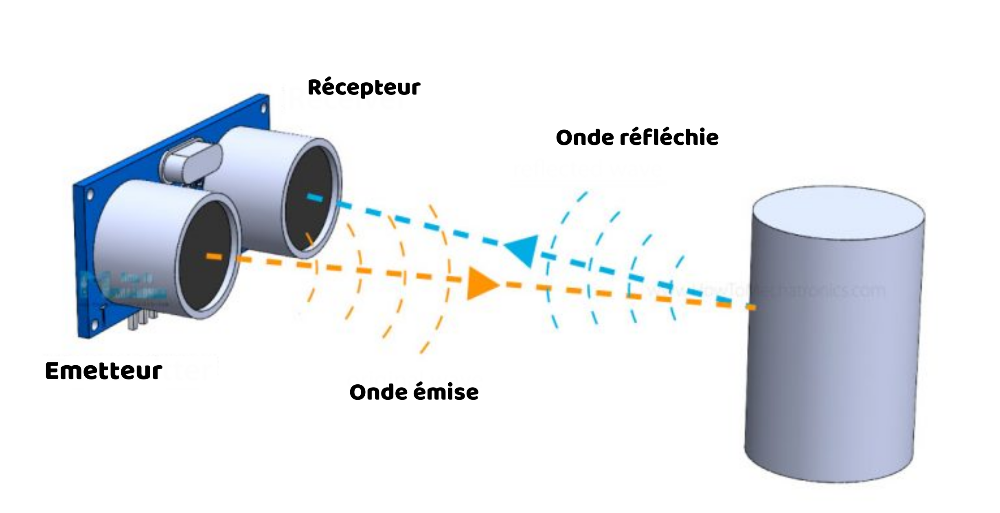
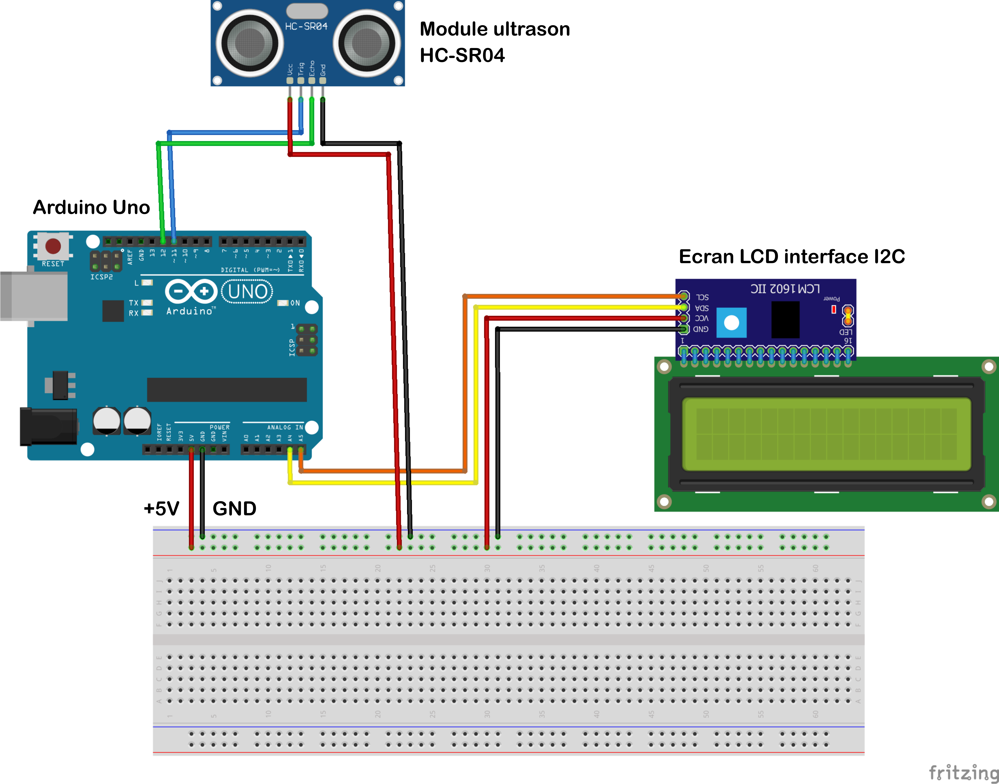
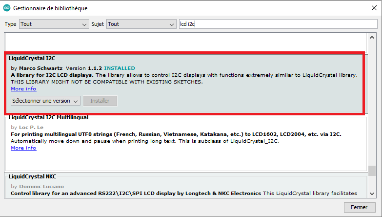
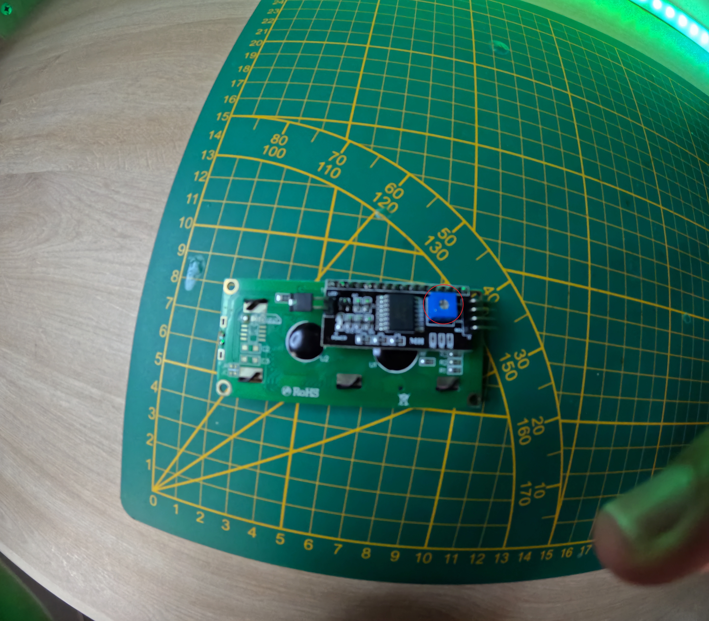

# Electr01-Arduino-Ultrason-LCD

Ce projet utilise un capteur ultrasonique HC-SR04 et un écran LCD 16x2 pour mesurer et afficher la distance en temps réel.

## 🛠 Matériel Nécessaire

- Arduino Uno
- Platine de prototypage
- Capteur ultrason HC-SR04  
- Écran LCD 16x2 + module I2C  
- Câbles de connexion mâle/femelle  

## ⚙️ Comment fonctionne le capteur de distance ultrasonique HC-SR04 ?

Le module émet un ultrason à 40 000 Hz qui se propage dans l'air. Si un objet ou un obstacle se trouve sur son chemin, l'onde sonore rebondit vers le capteur. En prenant en compte le temps de trajet et la vitesse du son, il est possible de calculer la distance.



## 🔌 Schéma de câblage

| Composant      | Arduino |
|---------------|---------|
| VCC (HC-SR04) | 5V      |
| Trig (HC-SR04) | D11      |
| Echo (HC-SR04) | D12     |
| GND (HC-SR04)  | GND     |
| SDA (LCD)      | A4      |
| SCL (LCD)      | A5      |




## 💾 Installation

1. Installe la bibliothèque `LiquidCrystal_I2C` dans l'IDE Arduino.  
     
2. Télécharge le code `sonar_lcd.ino` dans le dossier `Code` et téléverse-le sur ton Arduino.  
3. Ajuste le rétroéclairage de l'écran LCD à l'arrière avec un tournevis.  
     

## 📜 Code Arduino

```cpp
#include <LiquidCrystal_I2C.h>
#include <Wire.h>

// Initialisation de l'écran LCD (adresse I2C 0x27, écran 16x2)
LiquidCrystal_I2C lcd(0x27, 16, 2);

// Définition des broches utilisées pour le capteur ultrasonique
const int trigPin = 11; // Broche Trigger (émission)
const int echoPin = 12; // Broche Echo (réception)

// Variables utilisées pour le calcul de la distance
long duree;     // Durée du signal d'écho
int distance;   // Distance calculée en cm

void setup() { 
    // Configuration des broches du capteur
    pinMode(trigPin, OUTPUT); // Trigger en sortie
    pinMode(echoPin, INPUT);  // Echo en entrée
    
    // Initialisation de l'écran LCD
    lcd.init();
    lcd.backlight(); // Activation du rétroéclairage
} 

void loop() { 
    // Émission d'un signal de 10 microsecondes
    digitalWrite(trigPin, LOW); 
    delayMicroseconds(5); 
    digitalWrite(trigPin, HIGH); 
    delayMicroseconds(10); 
    digitalWrite(trigPin, LOW); 

    // Mesure de la durée du signal d'écho
    duree = pulseIn(echoPin, HIGH); 

    // Calcul de la distance en cm (vitesse du son = 0.034 cm/µs)
    distance = duree * 0.034 / 2; 

    // Affichage sur l'écran LCD
    lcd.clear(); // Effacer l'écran avant d'afficher une nouvelle valeur
    lcd.setCursor(0, 0); // Placer le curseur en haut à gauche
    lcd.print("Distance:"); // Afficher "Distance:"
    lcd.setCursor(0, 1); // Placer le curseur en bas à gauche
    lcd.print(distance); // Afficher la valeur de la distance
    lcd.print(" cm"); // Ajouter "cm" après la valeur

    delay(100); // Mise à jour rapide
}
```
## 📢 Nous suivre et nous soutenir  

🔗 **TikTok** : [@ironlab_974](https://www.tiktok.com/@ironlab_974?_t=ZN-8ul8u0JAI7y&_r=1)  
📺 **YouTube** : [IronLab 974](https://youtube.com/@ironlab_974?si=bJzcrzHVzDJ_9-O3)  
📸 **Instagram** : [@ironlab_974](https://www.instagram.com/ironlab_974?igsh=a3Njbm5majR2NTd6&utm_source=qr)  
🛒 **Site marchand** : [Marmaille Réunion](https://www.marmaille-reunion.fr)  


## 📚 Sources  

- [HowToMechatronics - HC-SR04](https://howtomechatronics.com/tutorials/arduino/ultrasonic-sensor-hc-sr04/)  
